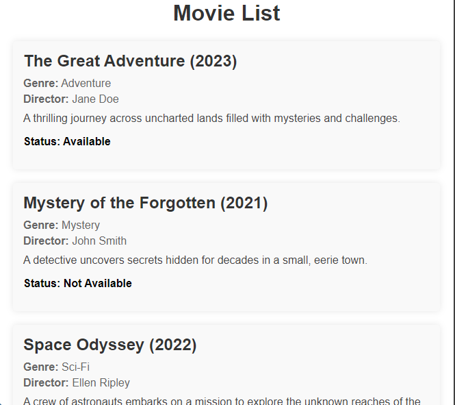

# movie-app
# Movie App

 <!-- Add a path to your screenshot image -->

## Description

Movie App is a full-stack application designed to manage and display movies. It features a RESTful API built with Node.js and Express, a MySQL database, and a React frontend. The app allows users to create, read, update, and delete movie records.

## Features

- **CRUD Operations**: Create, read, update, and delete movies.
- **Movie Details**: View detailed information about each movie.
- **Styling**: Modern and responsive design with basic styling.
- **Database Integration**: Uses MySQL to store movie information.

## Installation

### Prerequisites

- Node.js (version 14 or higher)
- MySQL
- npm or yarn

### Setup

1. **Clone the Repository**

   ```bash
   git clone https://github.com/yourusername/movie-app.git
   cd movie-app
